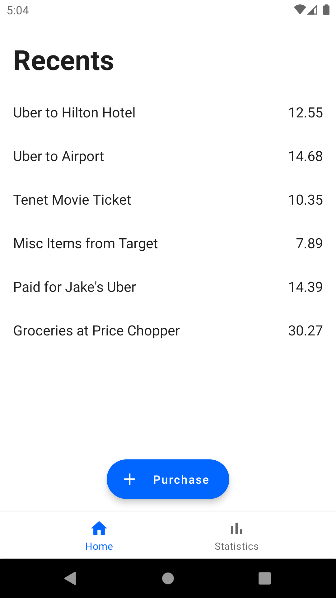
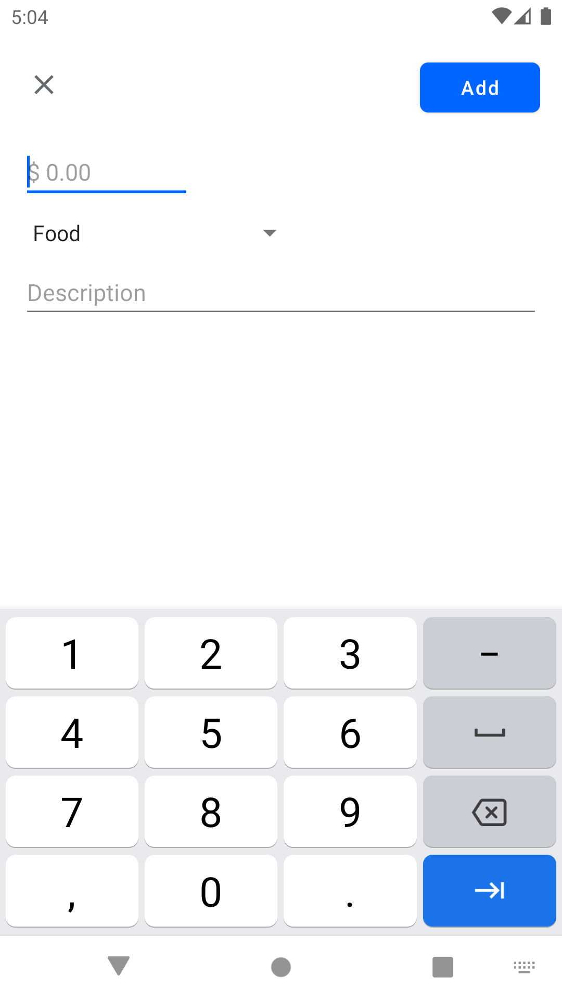
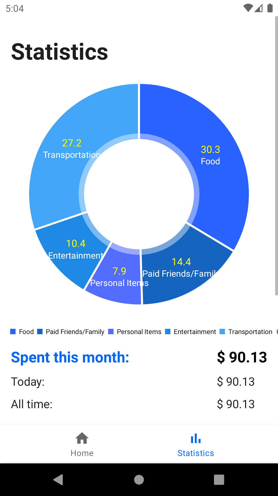
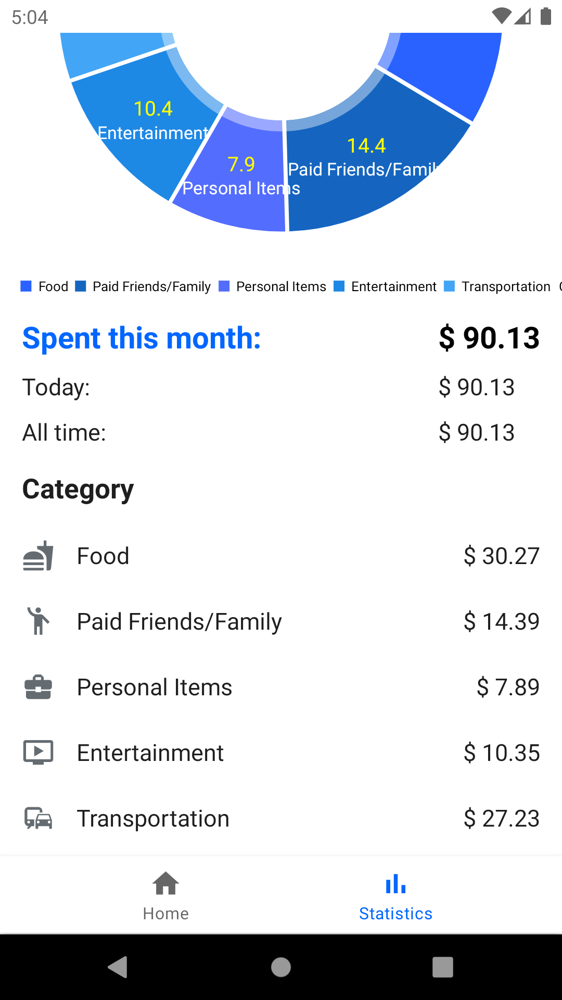

**DollarDollar** is an Android money tracker app that helps you keep track of the everyday purchases you make. 

Items are saved through Android Shared Preferences and converted into JSON with Google's [Gson](https://github.com/google/gson) library. 

The Pie Chart used is created through [MPAndroidChart](https://github.com/PhilJay/MPAndroidChart). 

Icons used are from Google's [Material Design Icons](https://material.io/resources/icons/?style=baseline).

## Screenshots

## How to Install

Download the zip file of the project. Extract the zip file and run the apk.

## Clearing Data

1. Go to home page or where DollarDollar app is located.
2. Hold the icon and press "App Info"
3. Go to Storage & cache"
4. Clear Storage
5. Open the app and use normally.